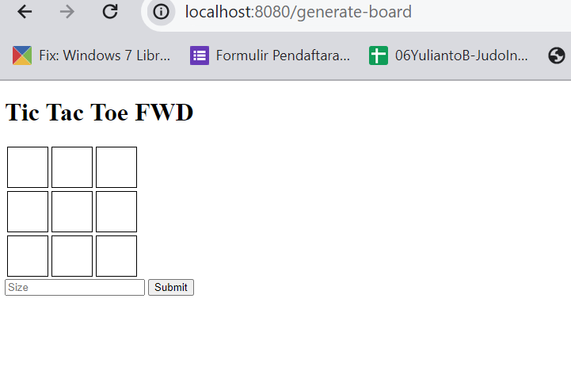

# TicTacToe (Woka)

## System Requirements

- Java OpenJdk version 17
- Docker Desktop
- Web Browser


## Run Unit Test
- Open terminal inside repository, run command:
```bash
  mvn clean test
```
- Open folder /target/site  click index.html  to get coverage unit test report

## How To Run App

1. git clone https://github.com/woka20/tictactoe_fwd.git
2. cd /tictactoe
3. Open terminal
4. run command

```bash
mvn clean package -DskipTests  
```

5. run command
```bash

docker build -t tictactoe-fwd-image .  

```

6. run command
```bash
docker run -p 8080:8080 tictactoe-fwd-image  
```

7. open browser  to localhost:8080



8. just input how many configure tictactoe board

9. play it by click with your friends

10.  run command to stop  
```bash
docker ps -l  
```

and 

```bash
docker stop <container_id>

```


## Run Unit Test
- Open terminal inside repository, run command:
```bash
  mvn clean test
```
- Open folder /target/site  click index.html  to get coverage unit test report